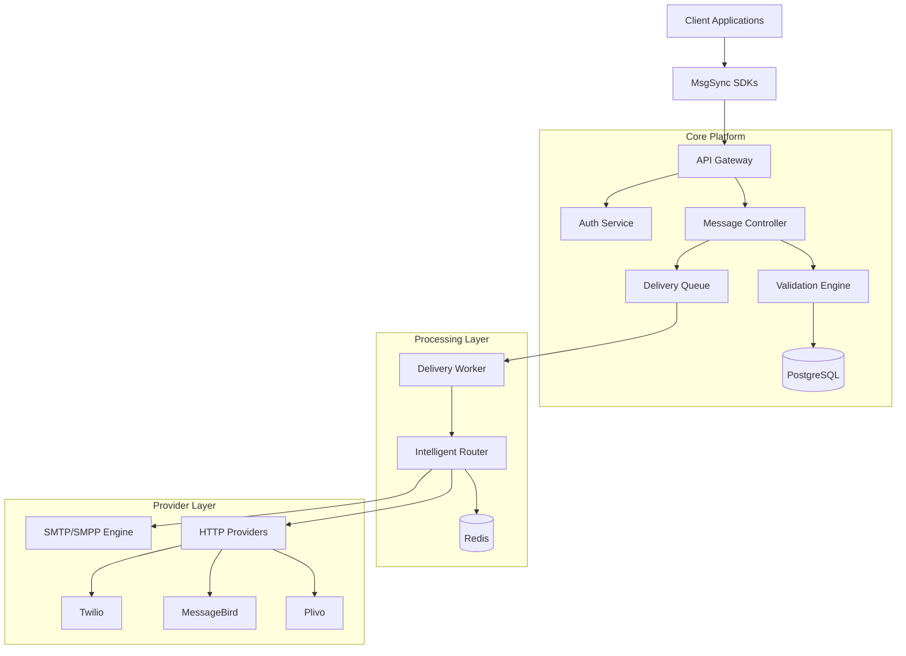

# MsgSync Architecture

MsgSync is designed as a carrier-grade messaging platform, emphasizing high availability, low latency, and horizontal scalability.

## High-Level Diagram

## Core Components

### 1. API Gateway

Handles request termination, authentication, rate limiting, and request logging. It serves as the entry point for all SDK and direct API interactions.

### 2. Message Controller & Queue

When a message is accepted, it is persisted in PostgreSQL and pushed to a robust BullMQ (Redis-backed) queue. This ensures that no message is lost even if the processing layer is temporarily overloaded.

### 3. Intelligent Router

The brain of the delivery engine. It evaluates available providers based on:

- **Cost**: Real-time rate comparison.
- **Performance**: Recent delivery success rates and latency.
- **Coverage**: Geographic and network-specific availability.
- **Priority**: Higher priority messages are routed through premium corridors.

### 4. Processing Workers

Stateless workers that consume from the delivery queue, execute routing logic, and interact with upstream providers. Workers can be scaled horizontally during peak traffic points.

---

## Data Persistence

- **PostgreSQL**: Stores persistent records including client accounts, API keys, balance, billing, message logs, and campaign configurations.
- **Redis**: Used for high-speed delivery queues, real-time analytics caching, rate limiting, and temporary routing metadata.

## Scalability & Reliability

- **Horizontal Scaling**: All components are stateless except for the databases, allowing easy scaling via Kubernetes or Docker Swarm.
- **Failover**: Intelligent routing automatically detects provider outages and fails over to healthy alternatives within seconds.
- **Monitoring**: Real-time telemetry via Prometheus/Grafana provides visibility into queue depths, delivery latency, and error rates.
